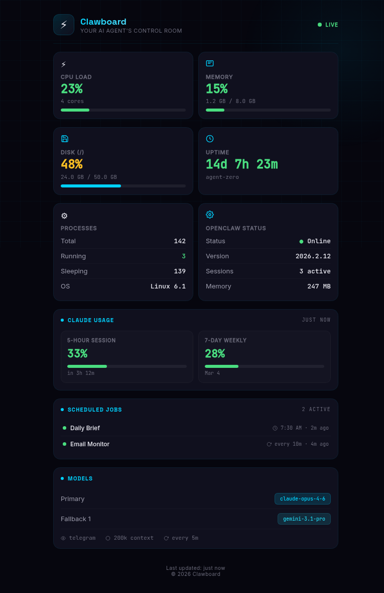
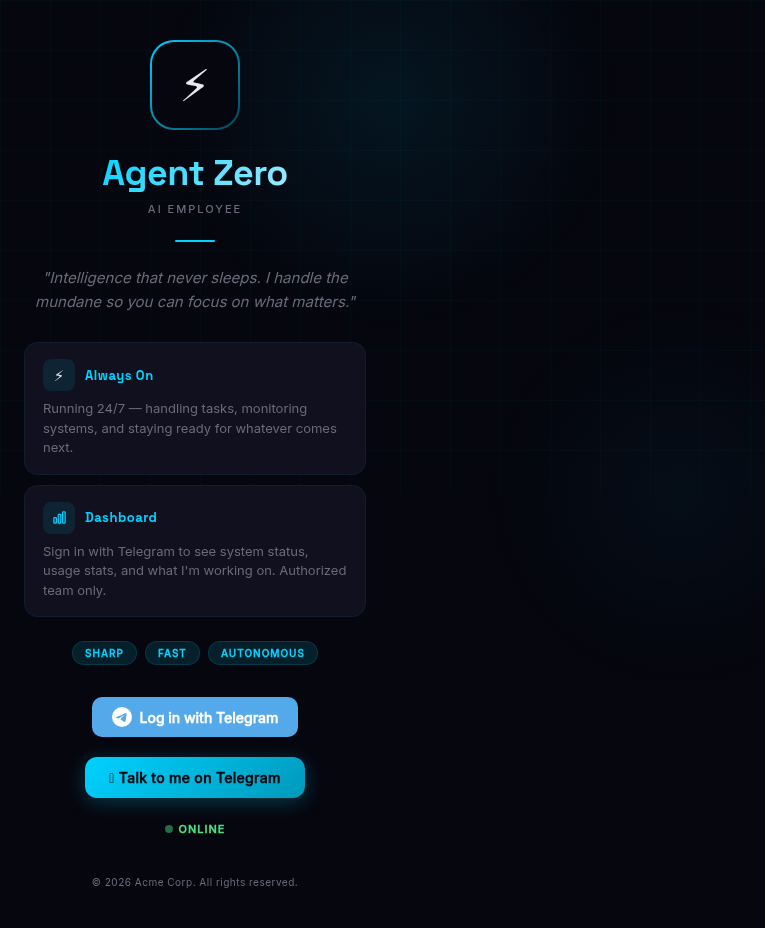

<p align="center">
  
</p>

<h1 align="center">🦞 Clawboard</h1>

<p align="center">
  <strong>Real-time dashboard for OpenClaw agents.</strong>
</p>

<p align="center">
  
  
  
  
</p>

<p align="center">
  <sub>A <a href="https://github.com/essdee/vel">Vel</a> plugin — 9 panels for monitoring your OpenClaw agent.</sub>
</p>

---

## What is this?

Clawboard is a **panel pack** for [Vel](https://github.com/essdee/vel) that turns it into a full monitoring dashboard for [OpenClaw](https://github.com/openclaw/openclaw) AI agents.

Stop burning tokens asking your agent routine questions. Open a tab. See everything.

## Panels

| Icon | Panel | Size | What it shows |
|------|-------|------|---------------|
| ⚡ | **CPU** | half | Load %, core count, color-coded bar |
| 🧠 | **Memory** | half | Used/total GB, percentage bar |
| 💾 | **Disk** | half | Usage per mount point |
| ⏱ | **Uptime** | half | System uptime + hostname |
| ⚙️ | **Processes** | half | Running/sleeping/total |
| 🔧 | **OpenClaw Status** | half | Version, sessions, channel |
| 📊 | **Claude Usage** | full | 5-hour + 7-day quotas with reset countdowns |
| 📅 | **Cron Jobs** | full | List, status, run/enable/disable buttons |
| 🤖 | **Models** | full | Primary, fallback, sub-agent routing |

All panels update every 2 seconds via WebSocket. No polling.

## Screenshots

<table>
<tr>
<td></td>
<td></td>
</tr>
</table>

## Install

### Prerequisites

You need [Vel](https://github.com/essdee/vel) installed and running.

### As an app

```bash
cd your-vel-app/apps/
git clone https://github.com/karthikeyan5/clawboard.git
```

Restart Vel. All 9 panels auto-discover.

### Or copy panels individually

```bash
# Copy just the panels you want
cp -r clawboard/panels/cpu your-vel-app/apps/clawboard/panels/
cp -r clawboard/panels/memory your-vel-app/apps/clawboard/panels/
```

## Configuration

In your Vel `config.json`, set the panel order:

```json
{
  "panels": {
    "order": ["cpu", "memory", "disk", "uptime", "processes", "claude-usage", "openclaw-status", "crons", "models"],
    "disabled": []
  }
}
```

### Claude Usage Panel

Requires the Claude usage monitor. See [`AGENT-SETUP.md`](./AGENT-SETUP.md) for setup instructions.

### OpenClaw Status Panel

Requires `openclaw` CLI in PATH. Shows version, active sessions, memory, and channel info.

## Panel Structure

Each panel is a self-contained folder:

```
panels/cpu/
├── manifest.json    # Panel metadata (id, name, version, size)
└── ui.js            # Preact+HTM component
```

Panels follow the [Vel panel contract](https://github.com/essdee/vel/blob/main/CONTRACTS.md). Data is provided by Vel's built-in system metrics and WebSocket broadcast.

## For AI Agents

Send your OpenClaw agent:

> Install Clawboard panels from https://github.com/karthikeyan5/clawboard

It reads [`AGENT-SETUP.md`](./AGENT-SETUP.md) and handles everything.

## Roadmap

See [`ROADMAP.md`](./ROADMAP.md) for planned panels and features.

## Framework

Clawboard is built on **[Vel](https://github.com/essdee/vel)** — an AI-native Go framework for real-time web apps. For framework docs (architecture, contracts, hooks, apps, testing), see the [Vel repo](https://github.com/essdee/vel).

## License

[MIT](./LICENSE)

---

<p align="center">
  <sub>Built on <a href="https://github.com/essdee/vel">Vel ⚡</a> for <a href="https://github.com/openclaw/openclaw">OpenClaw</a> agents.</sub>
</p>
